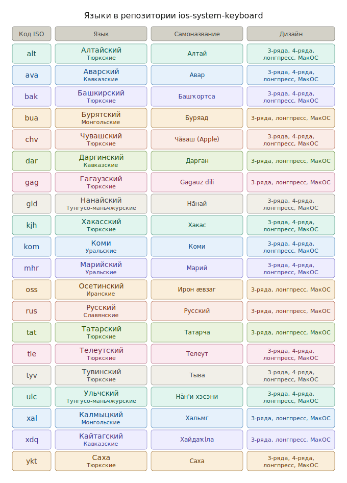
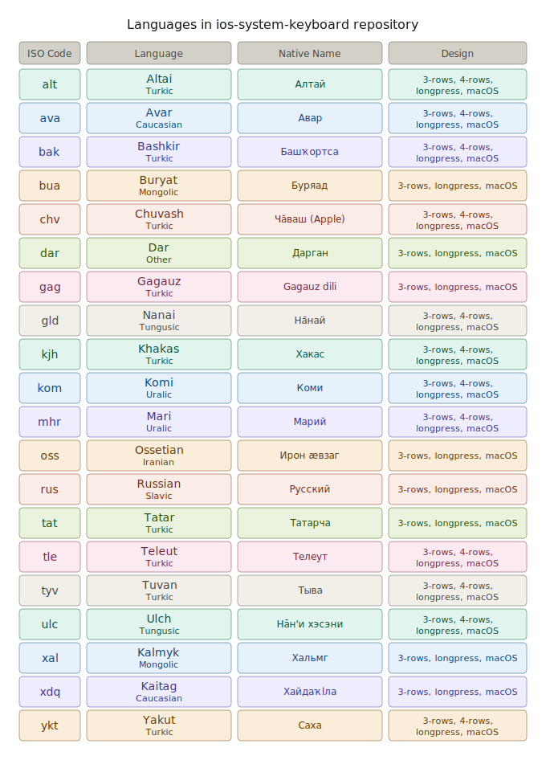

# 🇷🇺 Датасет клавиатур для iOS/macOS

Этот репозиторий содержит данные для системной клавиатуры на iOS/macOS. Например, **Тувинский (Тыва дыл)**.  
Датасет подготовлен для использования в системах ввода (например, Apple Keyboard, Unicode CLDR и других).

## 📘 Описание
Датасет для расскладки клавиатуры основана на современном дизайне, используемой в iOS и macOS.

Раскладки соответствуют унифицированной схеме клавиатуры, и совместимы с инструментами генерации раскладок для конкретных платформ.

Вы можете использовать подход как я сделал на примере ``tyv – Тыва дыл`` (Тувинский язык), слегка модифицируя ряды расскладки, включив все символы, используемые в современном письме выбранного языка.

Цель — предоставить корректную и удобную раскладку для носителей языка, включая поддержку автокоррекции, предсказаний и локализованных символов.

Минимально нужно описать файлы ``lang-3-rows.yaml`` и ``lang-longpress.yaml``, где вместо lang – код вашего языка.

### Знакомый пример
Большинство из вас хорошо знакомы с системной клавиатурой для Русского языка. Она описана [тут (тык сюда)](https://github.com/Agisight/ios-system-keyboard/tree/main/layout/rus).

## 🧩 Структура репозитория
```
ios-system-keyboard/
 ├── layout/tyv/
 │   ├── tyv-3-rows.yaml
 │   ├── tyv-4-rows.yaml
 │   ├── tyv-longpress.yaml
 │   ├── tyv-macos.yaml
 │   └── tyv-3-rows.png
 └── README.md
```

## 🗝️ Пример (фрагмент)
```
iOS:
  primary:
    layers:
      default: |
        й ү у к е н ң г ш з х
        ө ы в а п р о л д ж э
        \s{shift} я ч с м и т ь б ю \s{backspace}
      shift: |
        Й Ү У К Е Н Ң Г Ш З Х
        Ө Ы В А П Р О Л Д Ж Э
        \s{shift} Я Ч С М И Т Ь Б Ю \s{backspace}
```

## Переводы системных команд
Особое внимание уделяем системным командам типа "Отмена", "Ввод", "Маршрут" и т.д.

Есть особый гайд – [keyNames.md](https://github.com/Agisight/ios-system-keyboard/blob/main/keyNames.md). Изучите обязательно, есть наглядные примеры с картинками.

## Что нужно сделать (кратко)
 1. Перевести системные команды (или кнопки) как описано в keyNames.
 2. Определить файл лонгпрессов – ``lang-longpress.yaml`` (например, для Русского языка это пары Ь – Ъ, Е – Ё). Там же уточнить лонгпрессы символов, можно как на русской клавиатуре.
 3. Замена АБВ (кнопка для смены с символов на буквы). Можете оставить так же. Но для ряда языков другие буквы.
 4. Определить главную клавиатуру для iOS в файле ``lang-3-rows.yaml`` (для Айфона 1 схема, для Айпада 2 схемы).
 5. Определить вторичную клавиатуру для iOS на 4 строки в файле ``lang-4-rows.yaml`` (для Айфона 1 схема, для Айпада 2 схемы). Не обязательно.
 6. Определить клавиатуру для macOS – **обязательно**.
 7. Когда все сделаете все этапы, можете отправить ваши файлы мне, либо оформить как PR в Гитхабе.

## 🌍 Supported Languages
<p align="center">
  
</p>

## 🌍 Контакт
Автор: Али Кужугет (Али Күжүгет)  
Проект: *Apple системные кириллические клавиатуры для всех*  

---

# 🇺🇸 Dataset for iOS/macOS Keyboards

This repository contains layout data for any languages. For example, the **Tuvan Cyrillic keyboard**,
designed for integration with Apple Keyboard, Unicode CLDR, and related input systems.

## 📘 Description
The keyboard layout dataset is based on the modern design used in iOS and macOS.

The layouts conform to a unified keyboard scheme and are compatible with layout generation tools for specific platforms.

You can use the approach I used in the example of "tyv – Тыва дыл" (Tuvan language), slightly modifying the layout rows to include all the characters used in the modern writing system of the selected language.

Its goal is to provide native users with a convenient, accurate, and inclusive typing experience.

At a minimum, you need to describe the files ``lang-3-rows.yaml`` and ``lang-longpress.yaml``, where lang is the code of your language.

### A familiar example
Most of you are familiar with the system keyboard for Russian. It's described [here (click here)](https://github.com/Agisight/ios-system-keyboard/tree/main/layout/rus).

## 🧩 Repository Structure
```
ios-system-keyboard/
 ├── layout/tyv/
 │   ├── tyv-3-rows.yaml
 │   ├── tyv-4-rows.yaml
 │   ├── tyv-longpress.yaml
 │   ├── tyv-macos.yaml
 │   └── tyv-3-rows.png
 └── README.md
```

## 🗝️ Example (fragment)
```
iOS:
  primary:
    layers:
      default: |
        й ү у к е н ң г ш з х
        ө ы в а п р о л д ж э
        \s{shift} я ч с м и т ь б ю \s{backspace}
      shift: |
        Й Ү У К Е Н Ң Г Ш З Х
        Ө Ы В А П Р О Л Д Ж Э
        \s{shift} Я Ч С М И Т Ь Б Ю \s{backspace}
```

## Translations of system commands
We pay special attention to system commands such as "Cancel," "Enter," "Route," and so on.

There's a special guide – [keyNames.md](https://github.com/Agisight/ios-system-keyboard/blob/main/keyNames.md). Be sure to check it out; there are illustrative examples with pictures.

## What needs to be done (briefly)
1. Translate system commands (or buttons) as described in keyNames.
2. Define the longpress file – lang-longpress.yaml (for example, for Russian, these are the pairs Ь – Ъ, Е – Ё). You can also specify the longpress characters there, as on a Russian keyboard.
3. Replace ABC (the button for switching from symbols to letters). You can leave it as is. But for some languages, different letters are used.
4. Define the primary keyboard for iOS in lang-3-rows.yaml (for iPhone, there is one scheme, for iPad, there are two schemes).
5. Define a secondary keyboard for iOS with 4 rows in lang-4-rows.yaml (for iPhone, there is one scheme, for iPad, there are two schemes). Optional.
6. Detect the keyboard for macOS – **required**.
7. Once you've completed all the steps, you can send your files to me or submit them as a PR on GitHub.

## 🌍 Supported Languages
<p align="center">
  
</p>

## 🌍 Contact
Author: **Ali Kuzhuget**  
Project: *Apple Keyboards for All*
